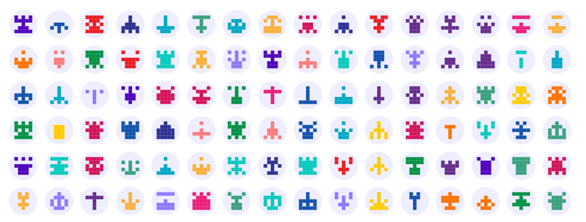
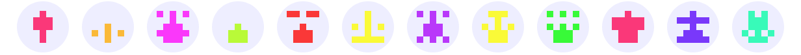
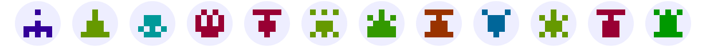

# Minidenticons

Super lightweight SVG identicon generator. No dependencies.


<sup>(using the custom element)</sup>


<sup>(custom element tree-shaken)</sup>

[](https://bundlephobia.com/package/minidenticons)
[](https://github.com/laurentpayot/minidenticons/blob/main/index.d.ts)
[](https://www.npmjs.com/package/minidenticons)
[](https://github.com/laurentpayot/minidenticons/blob/main/LICENSE)

[](https://laurentpayot.github.io/minidenticons/)

## Why

Generate identicons (pixelated avatars) on the client from usernames instead of fetching images from a server!

## Live Demo :video_game:

Play with it [here](https://laurentpayot.github.io/minidenticons/).

## On Browser

Minidenticons uses [ES modules](https://jakearchibald.com/2017/es-modules-in-browsers/), now [widely supported](https://caniuse.com/es6-module) in browsers.

### Using the `identicon-svg` custom element

Import the `identicon-svg` custom element from the `minidenticons.min.js` file. This file can be located in a CDN (example below) or copied in any directory of your website (for better performance, since you don’t have to connect to the CDN).

```html
<script type="module">
  import { identiconSvg } from 'https://unpkg.com/minidenticons@1.0.3/minidenticons.min.js'
</script>
```

Then simply use `identicon-svg` tags with an `username` attribute :joy:

```html
<identicon-svg username="alienHead66">
```

For instance with the `alienHead66` username you will get the following identicon (without the border):
<table><tr><td>

</td></tr></table>

- Note that the picture above is resized. [By default identicons will take all the space available.](https://raw.githubusercontent.com/laurentpayot/minidenticons/main/alienHead66.svg)

- The white space around the colored squares is here to allow uncropped circle avatars like the ones you can see in [the demo](https://laurentpayot.github.io/minidenticons/).

#### Color Customization

By default the color saturation and lightness are set to 50%. But you can change these values with the `saturation` and/or `lightness` attributes, for instance:

```html
<identicon-svg username="alienHead66" saturation="95" lightness="60">
```

Play with [the demo](https://laurentpayot.github.io/minidenticons/) to find a combination of saturation and lightness that matches your website theme colors: light, dark, pastel or whatever :sunglasses:





### Using the `identicon` function

Alternatively, instead of `identiconSvg`, you can also import the [`identicon`](#usage) function described in the NodeJS section below and use it to generate SVG strings in your browser.


## On NodeJS

Be sure to use a NodeJS version greater or equal to **13.2.0** to support [ES modules](https://nodejs.org/api/esm.html).

### Installation

```bash
npm install minidenticons
```

### Import

```javascript
import { identicon } from 'minidenticons'
```

The `identicon-svg` custom element should be tree-shaken from your bundle, for an even smaller size of minidenticons :grin:

### Usage

```typescript
identicon(username: string, saturation?: number|string, lightness?: number|string): string
```

The `identicon` function will return a SVG string generated from its username string argument. The optional saturation and lightness arguments should be percentages, i.e numbers (or strings) between 0 and 100.

## Collisions

You will always get the same identicon for a given username. But it is not impossible to have different usernames with the same identicon. That's a [collision](https://en.wikipedia.org/wiki/Hash_collision).

Generated identicons are 5×5 pixels large with vertical symmetry, and can have 18 different hues for the same saturation and lightness.
This means there are 2<sup>(3×5)</sup> × 18 = 589,824 different identicons possible, but actually much less because of the modulo-based algorithm used to get more colored pixels at the center of the identicon instead of having them scattered. So duplicate identicons are inevitable when using a lot of them. It shouldn’t matter as identicons should not be used solely to identify an user, and should always be coupled to a *unique* username :wink:

The `npm test` command results below show that you have roughly a 7% chance to generate a duplicate identicon when already using 1000 of them.

```text
0 collisions out of 100 (0.00%)
0 collisions out of 200 (0.00%)
2 collisions out of 300 (0.67%)
6 collisions out of 400 (1.50%)
11 collisions out of 500 (2.20%)
21 collisions out of 600 (3.50%)
38 collisions out of 700 (5.43%)
49 collisions out of 800 (6.13%)
55 collisions out of 900 (6.11%)
66 collisions out of 1000 (6.60%)
296 collisions out of 2000 (14.80%)
589 collisions out of 3000 (19.63%)
962 collisions out of 4000 (24.05%)
1441 collisions out of 5000 (28.82%)
1965 collisions out of 6000 (32.75%)
2564 collisions out of 7000 (36.63%)
3173 collisions out of 8000 (39.66%)
3860 collisions out of 9000 (42.89%)
4570 collisions out of 10000 (45.70%)
```

## License

[MIT](https://github.com/laurentpayot/minidenticons/blob/main/LICENSE)
